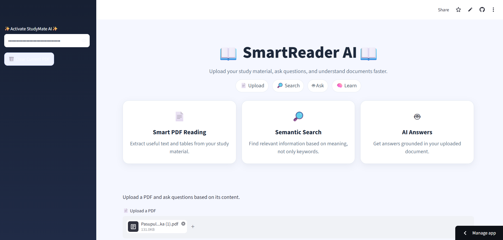

# 📖 SmartReader AI

> **AI-Powered Learning Companion for PDF Study Materials**

SmartReader AI is a Streamlit-based **Retrieval-Augmented Generation (RAG)** application that allows students to upload PDF study materials and ask questions about their content.

Instead of sending the whole PDF directly to an AI model, the application extracts the document content, splits it into smaller chunks, converts those chunks into embeddings, stores them in a persistent ChromaDB vector database, retrieves the most relevant chunks for a question, and then generates an answer using an AI model.

---

## ✨ Features

- 📚 Upload PDF study materials
- 📄 Extract text from PDFs using PyMuPDF
- 📊 Extract tables using pdfplumber
- ✂️ Split documents into overlapping chunks
- 🧠 Generate semantic embeddings using Sentence Transformers
- 🗄️ Store embeddings persistently in ChromaDB
- 🔎 Perform semantic similarity search
- 🤖 Generate answers using a Hugging Face hosted LLM
- 💬 Ask natural-language questions about uploaded documents
- 🔐 Enter the Hugging Face API key securely through the Streamlit sidebar
- 🧹 Clear the current PDF and start a new session
- 🔎 View the retrieved context used to generate an answer
- 🎨 Clean Streamlit UI with custom CSS styling

---

## 🛠️ Technologies Used

| Technology | Purpose |
|---|---|
| **Python** | Main programming language |
| **Streamlit** | Web application and user interface |
| **PyMuPDF (fitz)** | Extract text from PDF files |
| **pdfplumber** | Extract tables from PDFs |
| **Sentence Transformers** | Generate text embeddings |
| **all-MiniLM-L6-v2** | Embedding model |
| **ChromaDB** | Persistent vector database |
| **LangChain Core** | Prompt and document abstractions |
| **OpenAI Python SDK** | Connect to the Hugging Face OpenAI-compatible API |
| **Hugging Face Router** | Access the LLM for answer generation |
| **HTML/CSS** | Custom UI styling |

---

## 🔄 How the RAG Pipeline Works

```text
                ┌─────────────────┐
                │   Upload PDF    │
                └────────┬────────┘
                         ↓
                ┌─────────────────┐
                │ Extract Text &  │
                │     Tables      │
                └────────┬────────┘
                         ↓
                ┌─────────────────┐
                │  Split into     │
                │     Chunks      │
                └────────┬────────┘
                         ↓
                ┌─────────────────┐
                │ Generate        │
                │ Embeddings      │
                └────────┬────────┘
                         ↓
                ┌─────────────────┐
                │ Store in        │
                │   ChromaDB      │
                └────────┬────────┘
                         │
            User Question
                         ↓
                ┌─────────────────┐
                │ Semantic Search │
                └────────┬────────┘
                         ↓
                ┌─────────────────┐
                │ Top Relevant    │
                │     Chunks      │
                └────────┬────────┘
                         ↓
                ┌─────────────────┐
                │ RAG Prompt +    │
                │ Retrieved Text  │
                └────────┬────────┘
                         ↓
                ┌─────────────────┐
                │ Hugging Face    │
                │      LLM        │
                └────────┬────────┘
                         ↓
                ┌─────────────────┐
                │   AI Answer     │
                └─────────────────┘
```
## 🚀 Live Demo

Try SmartReader AI here:

[🔗 Open SmartReader AI](https://smartreader-ai-ragapplication.streamlit.app/)

---

## 🖥️ Application Preview



## 📌 Future Improvements

Possible future enhancements:

- 🌐 Deploy the application online
- 📑 Support multiple PDFs
- 🧾 Add page numbers to retrieved chunks
- 💬 Add chat history
- 🎯 Improve chunking and retrieval
- 🔍 Add hybrid keyword + semantic search
- 📸 Add OCR support for scanned PDFs
- 📊 Add document statistics
- 📥 Allow users to download generated answers
- 👤 Add user authentication
- 🗃️ Add document management

---


## 👩‍💻 Author

**Pasupuleti Mounika**

B.Tech – Computer Science Engineering (AI & ML)

---

## ⭐ Project Highlights

This project demonstrates practical implementation of:

**PDF Processing → Text Chunking → Embeddings → Vector Database → Semantic Retrieval → RAG → LLM Answer Generation**

It is designed as an AI-powered study assistant that helps students quickly understand and search their PDF study materials.
